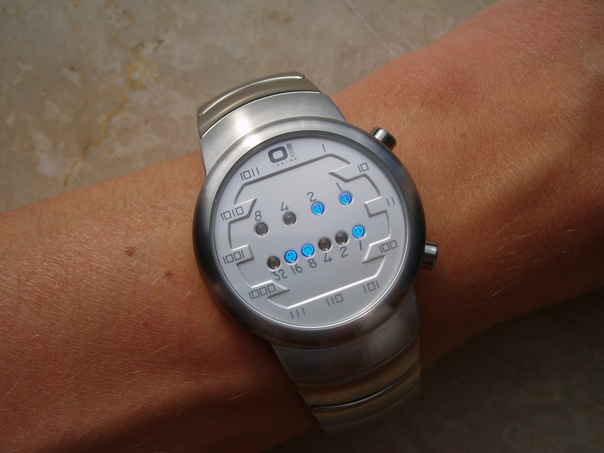

# Problem

A binary watch has 4 LEDs on the top which represent the hours (0-11), and the 6 LEDs on the bottom represent the minutes (0-59).

Each LED represents a 0 or 1, with the least significant bit on the right.



For example, the above binary watch reads `3:25`.

Given a non-negative integer `n` which represents the number of LEDs that are currently on, return all possible times the watch could represent.

## Example

```
n = 1
result = ["1:00", "2:00", "4:00", "8:00", "0:01", "0:02", "0:04", "0:08", "0:16", "0:32"]
```

## Note

- The order of output does not matter.
- The hour must not contain a leading zero, for example `01:00` is not valid, it should be `1:00`.
- The minute must be consist of two digits and may contain a leading zero, for example `10:2` is not valid, it should be `10:02`.

# Solution

## Fully Pre-Computed

`n` can only be from `0` to `8`, and there are only 12 x 60 = 720 possible time strings, so everything can be pre-computed, and return instantly.

## Half Pre-Computed

Instead of the whole time string, we can pre-compute the hours and minutes strings (or ints) separately, indexed by how many lights are on for the hour and minute. Then iterate the possible combinations, and join the hour and minute strings to be time strings.

## Not Pre-Computed

Iterate the hour (0-11) and minute (0-59) ranges, count the number of `1` in the binary representations, when the number of `1` equals `n`, keep that time string.
